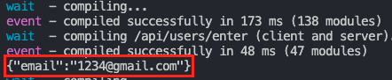
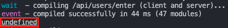
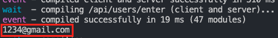

# hangout-carrot-market-with-nomad

[캐럿마켓 클론코딩](https://nomadcoders.co/carrot-market/)을 따라한 과정

## Quick start

### Run your applciation

```bash
# At the root of repository
# Clean Install - dependencies without fixing lock files for same version
npm ci

# Start Next.js Application
npm run dev
```

## History

### Initiation

1. [Tailwind](https://tailwindcss.com/)

    > Tailwind CSS는 오픈 소스 CSS 프레임워크

    ```bash
    npm install -d tailwindcss postcss autoprefixer
    
    ## (-p를 붙이면 postcss.config.js파일까지 생성)
    npx tailwindcss init -p 
    ```

    ```javascript
    /** @type {import('tailwindcss').Config} */

    module.exports = {
      content: [
        "./pages/**/*.{js,jsx,ts,tsx}",
        "./components/**/*.{js,jsx,ts,tsx}"
      ],
      theme: {
        extend: {},
      },
      plugins: [],
    }
    ```

2. [PostCSS](https://postcss.org/)

    > PostCSS는 일상적인 CSS 동작을 자동화하기 위해 자바스크립트 기반 플러그인을 사용하는 소프트웨어 개발 도구

3. [Autoprefixer](https://github.com/postcss/autoprefixer)

    > 마크업 할 때 일부 브라우저에서 적용되지 않는 css 속성의 앞에 -mz-, -webkit- 등의 접두사를 자동으로 접두사를 붙여준다는 확장프로그램

4. [Prisma](https://www.prisma.io/)
    > Node.js와 Typescript ORM(Object Realtional Mapping)로 Javascript나 Typescript 와 database 를 SQL 코드를 쓰지 않고 연결해주는 라이브러리

    ```bash
    # Install Prisma
    npm install prisma --save-dev

    # set up Prisma with the init command of the Prisma CLI
    npx prisma init
    ```

5. [Planetscale](https://planetscale.com/)
    > 서버를 따로 관리하거나 유지보수 할 필요가 없는 database 플랫폼

    ```bash
    # Install Planetscale
    brew install planetscale/tap/pscale

    # Install MySQL-client
    brew install mysql-client

    # login
    pscale auth login

    # check region 
    pscale region list 

    # create database
    pscale database create <database> --region <region>
    pscale database create carrot-market --region ap-northeast 

    # connect database
    pscale connect carrot-market
    ```

    - 일반적인 MySQL, PostgresQL은 지원하는 foreign key constraint를 Vitess는 지원하지 않음
    - Scaling을 위해 데이터를 분산하기 때문임
    - 따라서 이 작업은 Prisma에서 수행시키도록 작성

    ```javascript
     // v4.5 이하
    generator client {
      provider = "prisma-client-js"
      previewFeatures = ["referentialIntegrity"]
    }
    datasource db {
      provider = "mysql"
      url = env("DATABASE_URL")
      referentialIntegrity = "prisma"
    }

     // v4.5 이상
     generator client {
      provider = "prisma-client-js"
    }
    datasource db {
      provider     = "mysql"
      url          = env("DATABASE_URL")
      relationMode = "prisma"
    }
    ```

    ```bash
    # 위 설정이 끝난후 
    # pscale connect가 되어 있는 상태에서 
    # push db
    npx prisma db push
    ```

6. [Prisma Client](https://www.prisma.io/client)

    ```bash
    npm install @prisma/client
    ```

7. [Prisma Studio](https://www.prisma.io/studio)
    > Prisma가 제공해주는 데이터를 확인하는 관리자  패널

    ```bash
    npx prisma studio
    ```

8. [React Hook Form](https://react-hook-form.com/)
    > React에서 form의 유효성을 검사하는 데 도움이 되는 라이브러리

    ```bash
    npm install react-hook-form
    ```

9. [Twilio](https://www.twilio.com/en-us)
    > Programmable SMS, Programmable Audio, Authy 등의 다양한 문자, 전화, 인증과 관련된 기능을 Javascript를 포함한 다양한 언어로 모듈을 제공

    ```bash
    npm install twilio 
    ```

9. [Iron-session](https://github.com/vvo/iron-session)
    > 데이터를 저장하기 위해 서명되고 암호화된 쿠키를 사용하는 Node.js stateless session 유틸리티

    ```bash
    npm install iron-session
    ```

## Study

1. Uploading JSON data
    > POST프로토콜로 JSON인코딩된 데이터를 보내기 위해 fetch()를 사용한다.
    > body의 데이터 유형은 반드시 "Content-Type" 헤더와 일치해야 한다.

```javascript
await fetch(url, {
  method: "POST", // *GET, POST, PUT, DELETE 등
  body: JSON.stringify(data), // data can be `string` or {object}!
  headers:{
    "Content-Type": "application/json"
  }
})
```

- headers에 "Content-Type" 없이 req.body를 출력
[]  

- headers에 "Content-Type" 없이 req.body.email는 출력 되지 않음
[]

- headers에 "Content-Type"를 json으로 하고 req.body.email를 출력
[]

2. [NextAuth](https://next-auth.js.org/)
    > Next.js에서 Authentication 구현을 도와주는 패키지
    > 여기서는 사용하지 않지만 빠르게 구현하는데 도움이 될 수 있어 남겨둠

    ```bash
    npm i next-auth
    ```
